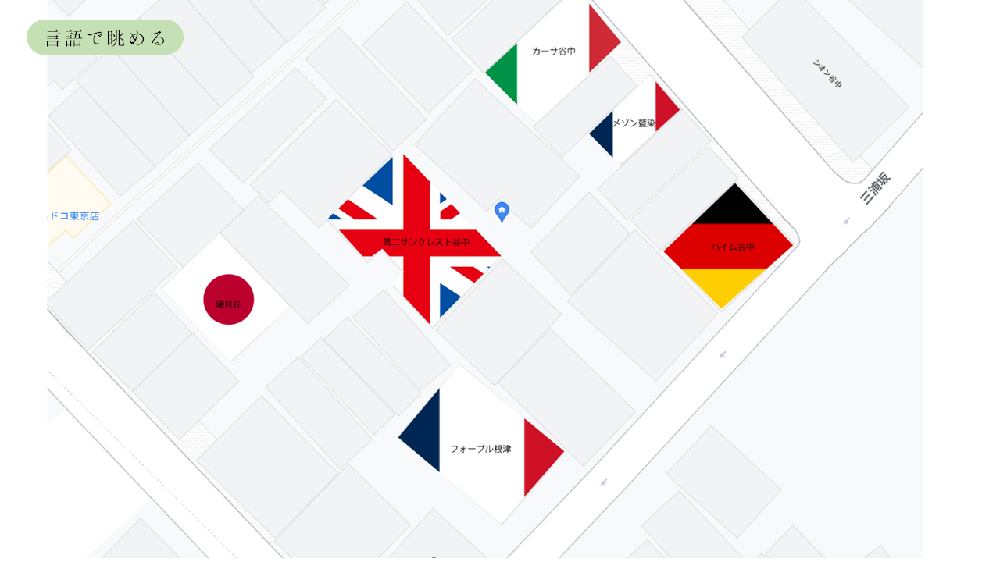
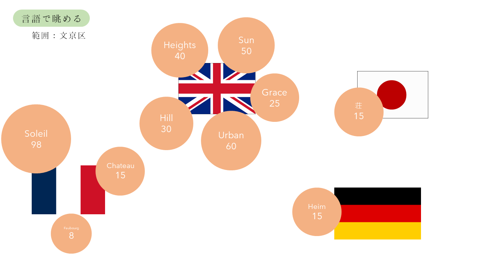
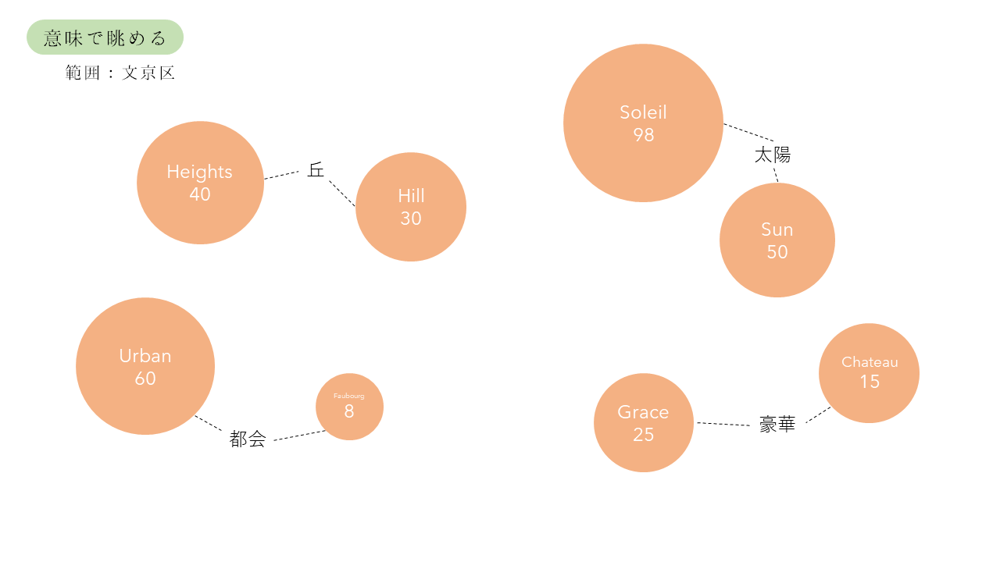
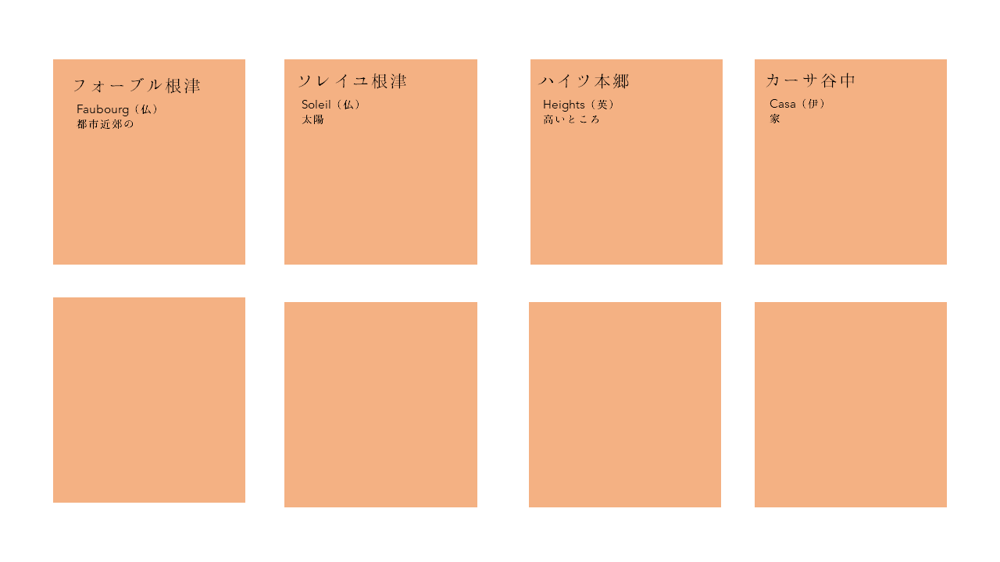

山口温大  
# 名前で探す/眺める物件
## 説明
メゾン、コーポ、ハイム、、。  
日本の建物名にはそんな名前が付けられていることが多い。そんな建物名を切り口として賃貸物件を眺めてみると、何か新しいことが見えてこないだろうか、というのがこのテーマの試むところである。
建物名に使われている言語、意味、建設年との関係などを統計、可視化することで、見る人に、「建物名」の面白さとそれを通して街を見る体験を提供する。
「ハイツ」が標高の高い区に集中していたり、ある年に「グラン」が増えていたりしたら面白いと思うのです。
## 方針
1. データ収集
2. データ整理（統計対象となる、「メゾン」などの接頭語を抽出する）
3. 様々な条件で統計をとる（町ごと、言語ごと、意味ごと、建設年ごとなど）
4. 可視化
（以下はあくまで例）

## 使用データセット・収集方法
SUUMOから都内の物件情報をスクレイピングする。
## 使用技術
HTML/CSS/Javascript(D3.js)
## 問題点
名前がどのくらい集中しているか不明。（ばらばらすぎると面白くないかも）
## その他
難しかったら地図はなくてもいいと思う。（sparseになる問題もあるし）
## 他の班員からの意見：

---

東大樹  
# キャッシュレス対応の飲食店の可視化

## 説明
近年はキャッシュレスに対応している飲食店が増えてきた。しかし、キャッシュレスにも様々な種類があり、なおかつわかりにくいので、それを可視化しようというもの
## 方針
paypayやlinepayなどの利用可能店舗を調べてそれを地図上に可視化
## 使用データセット・収集方法
それぞれの電子マネーのサイトなどからスクレイピング
## 使用技術
HTML/CSS/Javascript(D3.js)
## 問題点
データ収集が難しい、地図上に可視化するのも難しそう
## その他
## 他の班員からの意見：

---

平岡拓海  

# 潜在的に行きたい飲食店の可視化

## 説明：  
- 夜ご飯の店を友達と決める時など、「何食べたい？」と聞かれて自分が何食べたいかよくわからず、「何でもいいよ」と答え、友達を困らせてしまうことがあると思う。そこで、潜在的に自分が最も行きたい可視化したいと考えた。ホットペッパーapiを使うことになると考えられるので、食べたいものというより、食べたいジャンル（「和食」「洋食」「イタリアン・フレンチ」「中華」「焼肉・ホルモン」「韓国料理」「アジア・エスニック料理」「ラーメン」「お好み焼き・もんじゃ」「その他」）に対してと、店に対しての重みをつけて、その評価値でソートして上位5個とかを地図上に可視化する。

## 魅力：
- 自分に関する事実情報だけから、自分が本当に食べたいもの・行きたい飲食店を可視化することができるところ。

## 可視化のアルゴリズム  
- 個人的には事実ベースでユーザーに聞くのがいいと思う
1. 「食事の後にデートなどの予定ある？」（二択）
2. 「最近健康を気にしてる？」（「めちゃ気にしてる」「まあ健康に越したことはない」「ジャンキーなものが良い」「ジャンキー最高！」の四択）
3. 「どれくらい疲れている」（「もう歩けない」「10分くらいなら歩ける」「一駅くらいなら歩ける」「今からマラソンできるくらい元気もしくは電車移動も考えている」の四択）
4. 「食事で使える最低額」（バー調節）
5. 「食事で使える最高額」（バー調節）
6. 人数（「1~10以上」の範囲で選んでもらう）
7. 

## 方針：  
1. 質問からおすすめの飲食店をソートできるようにする
2. 上位5位を現在地とともに地図上に表示する。この際、経路なども同時に表示すると良さそう。
3. バーとか質問の答えと同期して、表示される店が変化するといいかも。

## 使用データセット・収集方法：
- ホットペッパーapi
  - [リファレンス](https://webservice.recruit.co.jp/doc/hotpepper/reference.html)
  - 一応使ったことある（平岡）。
- googlemapapi
  - 地図上に表示する際に使う。
  - 現在地も表示できる？
- どのジャンルが、「どれくらい健康か」「どれくらい臭うか」などの情報を調べる必要がある。
- 上と似ているが、事実と人間の食べたいものという心理がどのように結びついているかの裏を取る必要がある。例えば、「もう歩けない」と思っている時に、「実際歩けるのは何分くらいなのか？」など。
  - 論文で調べる。
  - アンケート調査

## 使用技術：  
- html/css/javascript

## 問題点：  
- アルゴリズムを決めるのが難しい。
  - このアルゴリズムは必ずしも正解がないと思うので、アンケートや論文検索を頑張る。
- 表示される店が偏る可能性がある。
  - ただ、現在地によってまばらになるはず。

## その他：  
## 他の班員からの意見：  
